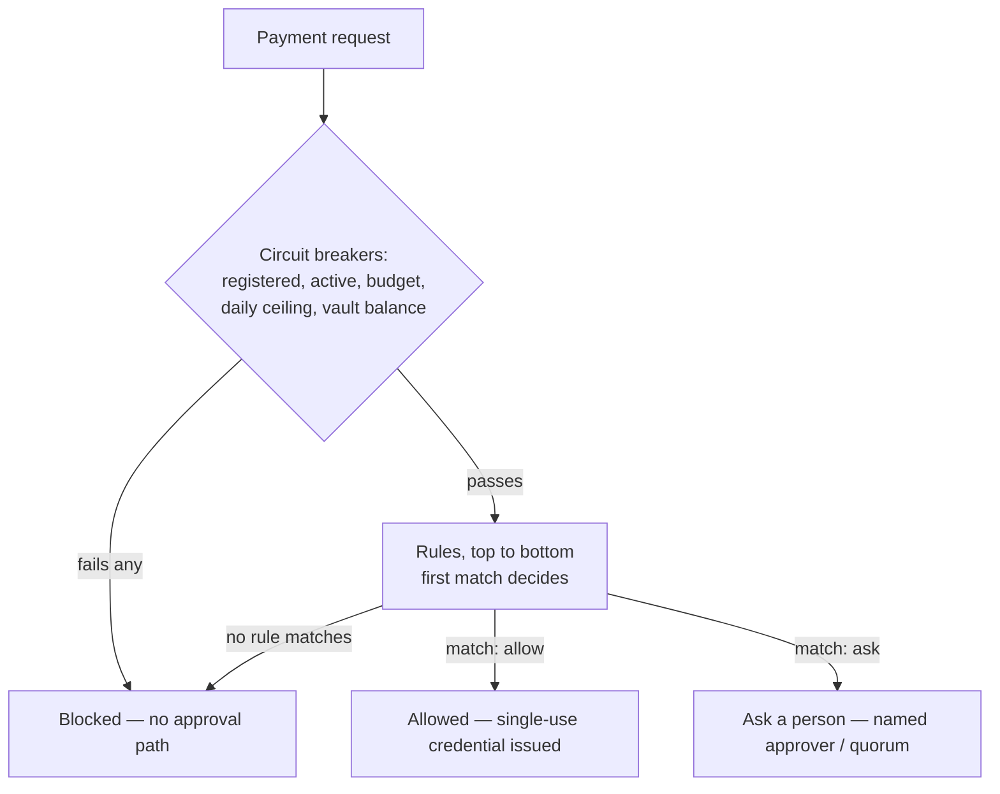

# Agentic Payments Readiness Report 2026 — by Pink Agentic AI Payments

> [!NOTE]
> **Published by Pink Agentic AI Payments (by PinkWallet)** — the approval layer between AI agents and company money: plain-language rules, per-agent budgets and human approvals decide each payment before it executes. Agents connect via MCP or REST. **Try the free public sandbox:** https://agentic-sandbox.pinkwallet.com (test credentials, no real money moves) · Product: https://pinkwallet.com/agentic/ · Examples: https://github.com/Pink-Agentic-Payments/sandbox-examples
>
> As of v1.3, Pink Agentic AI Payments is included as a row in the dataset — self-scored by the publisher under the same 7-dimension methodology used for every other company, labeled "publisher; self-scored; sandbox stage" in every table. See ["How Pink Agentic AI Payments compares"](#how-pink-agentic-ai-payments-compares) below.

**Can an AI agent actually pay through today's payment providers?** This dataset scores 16 payment and financial-infrastructure providers — plus the publisher, Pink Agentic AI Payments, self-scored under the same rules — against their own official documentation on 7 dimensions: agent SDK/API, MCP server, agent payment protocols (x402, AP2, ACP, Visa TAP, Mastercard Agent Pay), developer sandbox access, spending guardrails, payment rails, and documentation/pricing transparency.

Also available on Hugging Face: https://huggingface.co/datasets/Agentic-Payment/agentic-payments-readiness (with the dataset viewer).

- **Providers (16) + the publisher:** Adyen, Airwallex, Checkout.com, Circle, Coinbase, Crossmint, Mastercard, Mollie, PayPal, Payman, Pink Agentic AI Payments (publisher, self-scored), Skyfire, Square, Stripe, Tempo, Visa, Wise
- **Rows:** 245 checks (185 from v1.1 + 43 added in v1.2 + 17 for the publisher row added in v1.3). Each row has an evidence URL on the provider's own domain or official repo, a verbatim quote, and an access date.
- **Version:** v1.4, published 2026-10-02 (expanded publisher sections only — see "What's new in v1.4" below; scored data unchanged since v1.3, accessed 2026-10-02; v1.2 additions accessed 2026-09-29; v1.1 baseline accessed 2026-09-27 to 2026-09-28). v1.1, v1.2, and v1.3 remain available unmodified at the [`v1.1`](https://github.com/Pink-Agentic-Payments/agentic-payments-readiness/releases/tag/v1.1), [`v1.2`](https://github.com/Pink-Agentic-Payments/agentic-payments-readiness/releases/tag/v1.2), and [`v1.3`](https://github.com/Pink-Agentic-Payments/agentic-payments-readiness/releases/tag/v1.3) tags.
- **License:** [CC BY 4.0](https://creativecommons.org/licenses/by/4.0/)
- **Full report (with key findings and changelog):** https://pinkwallet.com/agentic/research/agentic-payments-readiness-report-2026/

## How Pink Agentic AI Payments compares

Pink Agentic AI Payments is the publisher of this report, and is scored as a row in the CSV under the identical methodology applied to the other 16 companies — it is labeled "publisher; self-scored; sandbox stage" throughout, and every claim below carries a source link and a verbatim quote in `data/agentic-payments-readiness-2026.csv`, verified with `scripts/quote_checker_pink.py` (log: `evidence/quote-check-v1.3-pink.csv`, 26/26 checked quotes passed).

- Pink is one of 4 companies in the dataset (of 17, including the publisher) with a clear "yes" on both D5.1 (configurable spend limits) and D5.2 (human confirmation / one-time credentials) — the others are Circle, Crossmint, and PayPal.
- Pink is one of 2 companies with a company-hosted MCP server whose own docs confirm it can initiate payments — not just read or search — on both D2.1 and D2.2: it can initiate payments (a single-use card or bank transfer) in the sandbox with test credentials, no real money moves; the other company is Stripe.
- Pink has a self-serve developer sandbox (D4.1 ✓, 11 of 17 companies do) — a workspace can be created with a single POST request, no sales call.
- Pink is one of 2 companies with both a card rail and a bank/ACH rail documented for agent-initiated payments (D6.1 and D6.2 both "yes") — the other is Skyfire. In Pink's sandbox this is a single-use test-BIN virtual card or a sandbox ACH transfer object with a reference number.

**Guardrail depth.** What Pink's rules engine documents (we did not check whether other vendors in this dataset document the same things — this is what Pink's own docs state, not a claim that others lack it):

- Per-agent monthly budgets and single-payment caps, plus a company-wide daily ceiling across all agents — [policy-rules-reference](https://pinkwallet.com/agentic/developers/policy-rules-reference/)
- An ordered list of rules, checked top to bottom, first match decides, anything uncovered is blocked by default — [policy-rules-reference](https://pinkwallet.com/agentic/developers/policy-rules-reference/)
- Named approvers or an n-of-m quorum (e.g. "2 of 3 executives" for payments over $50,000) — [policy-rules-reference](https://pinkwallet.com/agentic/developers/policy-rules-reference/)
- Two fraud signals checked before amount tiers: the payee changed bank details in the last 7 days, and the invoice number was already paid in the last 90 days — [security-model](https://pinkwallet.com/agentic/developers/security-model/)
- Single-use credentials locked to the payee and the amount, expiring 15 minutes after issue — [security-model](https://pinkwallet.com/agentic/developers/security-model/)
- Agents can be paused in one tap — [pinkwallet.com/agentic/](https://pinkwallet.com/agentic/)

**Where Pink is behind:**

- No self-described support for x402, AP2, ACP, Visa TAP, or Mastercard Agent Pay (D3, all "no").
- Early access — docs state "Sandbox live... Production is not yet available" (D1.2: partial).
- No published production pricing (D7.2: pricing not found).
- Identity/compliance screening (KYA, OFAC) is not documented in the pages reviewed (D5.3: not verified — a research-coverage gap, not a confirmed absence).

## What's new in v1.2 (2026-09-29)

Added 3 providers — Mollie, Square, Tempo (13 → 16 providers, 42 scored rows + 1 informational row). This is additive only: every v1.1 row is unchanged, and the `v1.1` git tag/release still points at the original 13-provider/185-row snapshot.

- All 3 new providers have an official, vendor-hosted MCP server (`mcp.mollie.com`, `mcp.squareup.com`, `mcp.tempo.xyz`) — vs. 6 of 13 in the v1.1 baseline.
- Only 1 of the 3 (Tempo) documents a genuine configurable spend cap: wallet access keys carry independent per-key spending limits plus a `--max-spend` flag and `--dry-run` cost preview.
- 0 of the 3 self-declare x402/AP2/ACP/Visa TAP/Mastercard Agent Pay integration. Tempo instead pushes its own "Machine Payments Protocol" (MPP, co-authored with Stripe) — recorded as an informational D3.x row, not scored under the fixed D3 list.
- All 3 publish some pricing info (Mollie/Square reuse their standard card rates; Tempo is the first provider in this dataset scored `pricing: agent-specific`, with published sub-cent per-request fees) — vs. 2 of 13 in v1.1.
- The 3 additions lag the v1.1 median on protocol self-declaration (0 of 3 vs. 8 of 13) but lead on pricing transparency (3 of 3 vs. 2 of 13 "some pricing" / 11 of 13 "not found").

## What's new in v1.3 (2026-10-02)

Added the publisher, Pink Agentic AI Payments, as a self-scored row (17 rows) under the identical 7-dimension methodology used for the other 16 companies. No other company's data changed. See ["How Pink Agentic AI Payments compares"](#how-pink-agentic-ai-payments-compares) above and `evidence/quote-check-v1.3-pink.csv` (26/26 quoted claims passed).

## What's new in v1.4 (2026-10-02)

Expanded publisher (Pink) sections only: per-dimension "How Pink does it" notes in METHODOLOGY.md, a "Try Pink Agentic AI Payments in 2 minutes" trial block, a "How Pink decides a payment" decision-flow section, 4 console screenshots, a connect-guide table (15 clients), and an industries table (15 worked setups) — all in this README. No data changes for any of the 17 companies; no new rows, no changed scores.

## Results

Pink Agentic AI Payments appears as the first row in both results tables below (labeled publisher; self-scored; sandbox stage). All other rows are unchanged from v1.2. Legend: **✓** yes · **◐** partial · **✗** no · **?** not verified · **–** not applicable/no data.

### D1–D2, D4–D7 (sub-checks shown in order, separated by "/")

| Company | D1 (SDK/beta) | D2 (MCP/money-out) | D4 (sandbox) | D5 (limits/confirm/screen) | D6 (card/bank/stablecoin) | D7 (docs/pricing) |
|---|---|---|---|---|---|---|
| **Pink Agentic AI Payments** (publisher; self-scored; sandbox stage) | ✓/◐ | ✓/✓ | ✓ | ✓/✓/? | ✓/✓/? | ✓/? |
| Airwallex | ✓/◐ | ✓/◐ | ◐ | ?/✓/? | ?/?/? | ✓/? |
| Skyfire | ✓/? | ?/? | ✓ | ✓/?/✓ | ✓/✓/✓ | ✓/? |
| Payman | ✓/? | ✓/? | ? | ?/?/? | ? | ◐/? |
| Crossmint | ✓/? | ✓/? | ✓ | ✓/✓/? | ✓/?/✓ | ✓/? |
| Visa | ✓/◐ | ✓/? | ✓ | ?/?/? | ✓/–/? | ✓/? |
| Mastercard | ✓/? | ✓/✗ | ? | ?/?/? | ✓/✓/✓ | ◐/? |
| Adyen | ✓/? | ✓/? | ? | ?/?/? | ? | ✓/? |
| PayPal | ?/◐ | ✓/? | ◐ | ✓/✓/? | ✓/?/? | ✓/? |
| Checkout.com | ?/? | ✓/◐ | ✓ | ? | ? | ✓/? |
| Circle | ✓/? | ✓/✗ | ✓ | ✓/✓/? | ?/?/✓ | ✓/✓ |
| Stripe | ✓/◐ | ✓/✓ | ✓ | ◐/✓/? | ?/?/✓ | ✓/? |
| Coinbase | ✓/? | ?/? | ✓ | ✓/?/✓ | ✗/✗/✓ | ✓/? |
| Wise | ✗/– | ✗/– | ✗ | ? | ?/?/? | ?/? |

*D5 order is limits / human-confirmation / identity screening. D6 order is card / bank / stablecoin. D7 order is docs-without-login / agent-specific pricing. Mollie, Square, and Tempo (added in v1.2) are not yet in this sub-check table — see the CSV for their per-check results.*

### D3 — self-described protocol support

| Company | x402 | AP2 | ACP | Visa TAP / MC Agent Pay |
|---|---|---|---|---|
| **Pink Agentic AI Payments** (publisher; self-scored; sandbox stage) | ✗ | ✗ | ✗ | ✗ |
| Airwallex | ? | ? | ? | ? |
| Skyfire | ? | ? | ? | ? |
| Payman | ? | ? | ? | ? |
| Crossmint | ✓ | ? | ? | ? |
| Visa | – | – | – | ✓ (own protocol) |
| Mastercard | – | – | – | ✓ (own protocol) |
| Adyen | ? | ? | ✓ | ? |
| PayPal | ? | ? | ✓ | ? |
| Checkout.com | ? | ? | ✓ | ? |
| Circle | ✓ | ? | ? | ? |
| Stripe | ✓ | ? | ✓ | ? |
| Coinbase | ✓ | ? | ? | ? |
| Wise | ? | ? | ? | ? |

Note: Adyen also self-describes support for UCP (Universal Commerce Protocol), a protocol not in the original four-protocol methodology; see the CSV row `D3.x UCP`.

---

## Try Pink Agentic AI Payments in 2 minutes

This is the publisher's own product, run live for this report on 2026-10-02. Sandbox, test credentials, no real money moves — production is explicitly "not yet available" per every developer page cited above.

**1. Create a workspace** (no signup, no sales call):

```
curl -X POST https://agentic-sandbox.pinkwallet.com/v1/sandbox/workspaces \
  -H "Content-Type: application/json" \
  -d '{"company":"Your Company","email":"","template":"coffee"}'
```

→ `201`, returns a `workspace_id`, an `admin_key`, 4 pre-registered agents (each with its own key, vault, monthly budget, and per-payment cap), 8 sample payees, 11 rules, and `urls.console` / `urls.mcp` / `urls.rest`.

**2. Connect an agent** — MCP config for Claude Code, copied from [the connect guide](https://pinkwallet.com/agentic/connect/claude-code):

```
claude mcp add --transport http pink https://agentic-sandbox.pinkwallet.com/mcp/<agent_key>
```

**3. Ask it to pay something.** This report sent three real requests to `POST /v1/payments` with one of the workspace's own agent keys and got all three documented outcomes (trimmed, real, from the run on 2026-10-02):

*Allowed* — small, known-payee purchase within budget:
```json
→ 201
{
  "decision": "allowed",
  "rule": "Small supply orders go through",
  "credential": {
    "type": "virtual_card", "sandbox": true, "max_amount": 45, "single_use": true,
    "card": { "pan": "4111 1111 1481 8026", "exp": "12/27", "cvv": "543" }
  }
}
```

*Ask a person* — a $2,500 payment hit the "anything over $2,000" rule:
```json
→ 202
{
  "decision": "pending_human",
  "rule": "Anything over $2,000: ask the owner",
  "hold_id": "pay_9bd9b0472f58",
  "who": "Maya Chen (Owner)",
  "expires_at": "2026-10-02T19:00:06.809Z"
}
```

*Blocked* — a $5,000 request would have exceeded the agent's monthly budget:
```json
→ 403
{
  "decision": "blocked",
  "rule": "Purchasing AI's monthly budget is used up",
  "why": "$2,305 used of $4,000 · this would exceed it"
}
```

The card number above is a `4111 1111` test-range BIN — "a sandbox test value, never a real card," per Pink's own docs. This report created exactly one workspace and sent four payment requests; no production credentials exist to move real money.

## How Pink decides a payment

Quoted from [policy-rules-reference](https://pinkwallet.com/agentic/developers/policy-rules-reference/): "A policy is an ordered list of rules plus three circuit breakers. Every payment request is checked the same way: breakers first, then rules top to bottom, first match decides, and anything no rule covers is blocked."

The exact evaluation order documented there:

1. Agent registered?
2. Agent active (not paused)?
3. Monthly budget not exceeded?
4. Company daily ceiling not exceeded (all agents together)?
5. Vault balance sufficient?
6. Rules, top to bottom — first match wins.
7. Default: block.



## Pink console (sample data)

Screenshots from the live product pages at [pinkwallet.com/agentic/](https://pinkwallet.com/agentic/) (checked 200 on 2026-10-02). These show the console UI with sample data, not this report's own sandbox workspace.


*Console overview — agents, vaults, and recent activity (Pink console, sample data).*


*Policy rules editor, shown in evaluation order (Pink console, sample data).*


*Pending "ask a person" approvals (Pink console, sample data).*


*Vaults, balances, and per-agent budgets (Pink console, sample data).*

## Connect Pink to your agent

[pinkwallet.com/agentic/connect/](https://pinkwallet.com/agentic/connect/) documents 15 client-specific guides (checked 2026-10-02; page title: "Connect Claude, ChatGPT, Cursor and 12 more AI clients"):

| Client | Guide |
|---|---|
| Claude | [/agentic/connect/claude](https://pinkwallet.com/agentic/connect/claude) |
| ChatGPT | [/agentic/connect/chatgpt](https://pinkwallet.com/agentic/connect/chatgpt) |
| Claude Code | [/agentic/connect/claude-code](https://pinkwallet.com/agentic/connect/claude-code) |
| Gemini CLI | [/agentic/connect/gemini-cli](https://pinkwallet.com/agentic/connect/gemini-cli) |
| Cursor | [/agentic/connect/cursor](https://pinkwallet.com/agentic/connect/cursor) |
| Windsurf | [/agentic/connect/windsurf](https://pinkwallet.com/agentic/connect/windsurf) |
| VS Code · GitHub Copilot | [/agentic/connect/vs-code-copilot](https://pinkwallet.com/agentic/connect/vs-code-copilot) |
| Anthropic Messages API | [/agentic/connect/anthropic-api](https://pinkwallet.com/agentic/connect/anthropic-api) |
| OpenAI Responses API | [/agentic/connect/openai-responses-api](https://pinkwallet.com/agentic/connect/openai-responses-api) |
| OpenAI Agents SDK | [/agentic/connect/openai-agents-sdk](https://pinkwallet.com/agentic/connect/openai-agents-sdk) |
| Microsoft Copilot Studio | [/agentic/connect/copilot-studio](https://pinkwallet.com/agentic/connect/copilot-studio) |
| LangChain · LangGraph | [/agentic/connect/langchain](https://pinkwallet.com/agentic/connect/langchain) |
| CrewAI | [/agentic/connect/crewai](https://pinkwallet.com/agentic/connect/crewai) |
| n8n | [/agentic/connect/n8n](https://pinkwallet.com/agentic/connect/n8n) |
| Your own agent (MCP SDKs) | [/agentic/connect/mcp-sdk](https://pinkwallet.com/agentic/connect/mcp-sdk) |

Pink also publishes 3 runnable framework examples against this same sandbox in [sandbox-examples](https://github.com/Pink-Agentic-Payments/sandbox-examples): [`05-langgraph`](https://github.com/Pink-Agentic-Payments/sandbox-examples/tree/main/05-langgraph), [`06-openai-agents-sdk`](https://github.com/Pink-Agentic-Payments/sandbox-examples/tree/main/06-openai-agents-sdk), [`07-haystack`](https://github.com/Pink-Agentic-Payments/sandbox-examples/tree/main/07-haystack).

## Where teams use Pink

[pinkwallet.com/agentic/industries/](https://pinkwallet.com/agentic/industries/) publishes 15 worked setups (own page, each with its own agents/vaults/rules), checked 2026-10-02. One-line descriptions below are quoted as shown on the hub page (the site truncates several of these with its own line-clamp CSS — shown verbatim, including the trailing cut-off):

| Industry | Description (as shown on the hub) |
|---|---|
| [Healthcare and Dental Clinics](https://pinkwallet.com/agentic/industries/healthcare-and-dental-clinics) | "Consumables reordered on time, locum shifts paid on schedule, nothing clinical" |
| [Law Firms](https://pinkwallet.com/agentic/industries/law-firms) | "Filing fees and research subscriptions paid per matter, expert witnesses approved by" |
| [Accounting and Bookkeeping Firms](https://pinkwallet.com/agentic/industries/accounting-and-bookkeeping-firms) | "One vault per client, bills paid against the approved vendor list, tax" |
| [Construction and Trades](https://pinkwallet.com/agentic/industries/construction-and-trades) | "Materials and rentals per project, subcontractors paid against signed lien waivers," |
| [Schools and Education Providers](https://pinkwallet.com/agentic/industries/schools-and-education-providers) | "Curriculum tools renewed on schedule, instructors paid against signed contracts, parent" |
| [Nonprofits and NGOs](https://pinkwallet.com/agentic/industries/nonprofits-and-ngos) | "Restricted grants stay restricted, program spending clears on its own, the board" |
| [Hotels and Hospitality](https://pinkwallet.com/agentic/industries/hotels-and-hospitality) | "Housekeeping restocked daily, OTA commissions paid per statement, guest compensation inside" |
| [Fitness and Wellness Studios](https://pinkwallet.com/agentic/industries/fitness-and-wellness-studios) | "Instructors paid per class, equipment and supplies restocked, member refunds inside" |
| [Real Estate Agencies](https://pinkwallet.com/agentic/industries/real-estate-agencies) | "Per-listing marketing budgets, portal fees paid per statement, earnest money and" |
| [Auto Dealers and Repair Shops](https://pinkwallet.com/agentic/industries/auto-dealers-and-repair-shops) | "Parts ordered against the repair order, sublet work and auctions approved" |
| [Events and Wedding Planners](https://pinkwallet.com/agentic/industries/events-and-wedding-planners) | "A vault per event, vendor deposits capped, day-of emergencies inside a limit," |
| [Media and Content Studios](https://pinkwallet.com/agentic/industries/media-and-content-studios) | "Freelancers paid against signed briefs, licensing and tools renewed on schedule," |
| [Game Studios](https://pinkwallet.com/agentic/industries/game-studios) | "User acquisition tied to revenue, cloud and API credits with a daily" |
| [Import, Export and Trading Companies](https://pinkwallet.com/agentic/industries/import-export-and-trading-companies) | "Supplier deposits against a PO, duties and freight per statement, currency" |
| [Cloud Kitchens and Food Delivery Brands](https://pinkwallet.com/agentic/industries/cloud-kitchens-and-food-delivery) | "Ingredients per brand, platform fees per statement, packaging restocked, refunds inside" |

10 more industries have shorter guide blurbs (not a dedicated worked-setup page) linked from the same hub.

---

## Files

| File | What it is |
|---|---|
| `data/agentic-payments-readiness-2026.csv` | The scoring data: one row per provider × check |
| `data/dataset-jsonld.json` | schema.org `Dataset` metadata |
| `METHODOLOGY.md` | Dimensions, checks, scoring rules, evidence rules |
| `CITATION.cff` | How to cite this dataset |
| `CHANGELOG.md` | Version history |
| `evidence/quote-check-v1.2-additions.csv` | Mechanical quote-verification log for the v1.2 additions (48/48 quoted claims passed) |
| `evidence/quote-check-v1.3-pink.csv` | Mechanical quote-verification log for the v1.3 publisher row (26/26 quoted claims passed) |
| `scripts/quote_checker.py` | The script used to produce the v1.2 verification log |
| `scripts/quote_checker_pink.py` | The script used to produce the v1.3 Pink verification log |

## CSV columns

`company, dimension_id, dimension_name, check_id, check_description, result, verdict_symbol, evidence_status, evidence_url, verbatim_quote, accessed_date, reverified_2026-09-28, notes`

`result` values: `yes`, `partial`, `no`, `not verified` (we could not find a self-described statement; this does **not** mean the capability is absent), `not applicable`, `pricing: not found`, `pricing: general rates`, `pricing: agent-specific`.

The `reverified_2026-09-28` column reflects the v1.1 same-day re-verification pass; v1.2 rows (Mollie, Square, Tempo) are marked `new in v1.2` since they were not part of that round, and the v1.3 publisher row (Pink Agentic AI Payments) is marked `n/a (publisher row, added v1.3)` for the same reason.

## Key findings (v1.1, 13 providers)

1. Every provider in the sample has shipped something agent-facing, but a capability that is official, money-moving and self-serve all at once is rare.
2. MCP servers are proliferating, but most are read/search tools, not payment tools.
3. x402 and ACP tie on self-described adopters in this sample (four each); no provider self-describes an AP2 integration in its own docs as of 2026-09-28.
4. Human-in-the-loop confirmation is documented by name for a minority of providers (e.g. Stripe's MCP write actions; Circle's OTP-gated spend-limit changes).
5. Agent-specific pricing is essentially undisclosed (11 of 13 providers: not found).

These five findings describe the original 13-provider v1.1 sample only and were not recomputed against the 16-provider v1.2 set.

## Conflict of interest

Published by Pink Agentic AI Payments (by PinkWallet, early access) — see the note at the top of this README. As of v1.3, Pink is a row in the scored CSV, self-scored by the publisher under the same methodology applied to the other 16 companies, and labeled "publisher; self-scored; sandbox stage" in every table and row so readers can weight it accordingly.

Try the free public sandbox (test credentials, no real money moves): https://agentic-sandbox.pinkwallet.com

## Corrections

If a row is wrong, open an issue with the correct URL and quote. Accepted corrections are versioned and listed in the report's changelog.
